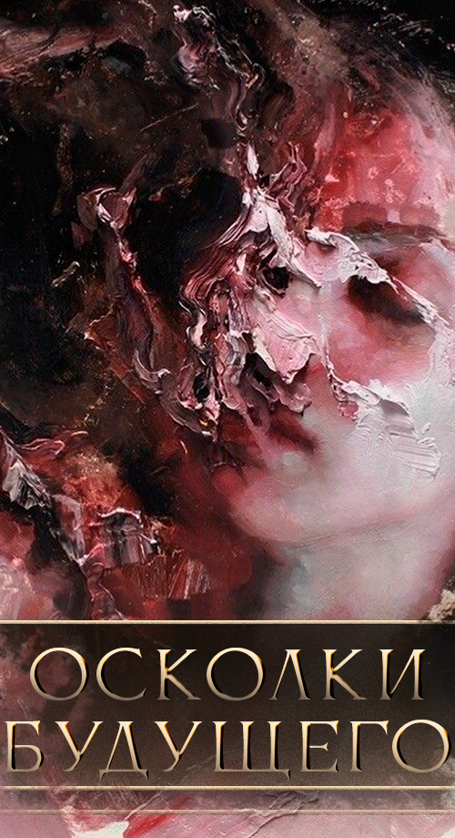

    
        
        

	

	At the passge under a Capital Hive the deprived of a name was crossing the river of Stakata. It was famous in the past times as Enghalhaa, mother of the flat-footed. Nameless saw how they were stepping out of the river and dying until finally they stepped on the ground with the firm foot.  
	The Child of Hlagn and Maakath, first child of Hlagn and the third offspring of the Maakath, he was damned with namelessness so his persona will not become an idol for many. But emotions on his face, but knowledge endless about anything and anytime. And the Time itself his parent.  
	Centuries in the self-exile, and the river of Engalhaa he was passing under the Capital Hive, and the plains prostrated he was going to, where he knew they are. 
	
 
	

	And the marsh laid on the way promised to be an obstacle, but to be a salvation for the ancestors of his or for the descendants of his, vague was the memory from the timelessness. But they followed the Nameless and a lot of them stayed in the Marshes. But he moved on and at the plains he turned back saw no soul behind, not a single face there was.  
	For a long time he walked and not only one generation died in front of him. But at the end of the way returned from a journey into cradle of him, walked into the meadows dying of patter of hooves. He saw the Time and the Time was watching at him. He asked the Time: «why are you watching me?» And the Time answered: «I only can force and never give a right for a mistake. And only over you I have no power, and I am trying to see: why?» 

	

	The Nameless answered: «I know the answers and I won't tell them because also I know what comes after this speech. I had never anxiety in my life because nothing was sudden in my life. I had never a dream because whole my life is for nothing.» But Time interruped him: «but you had a mother and father, you had those who followed you until the Marshes. Look at the grasses. Hear the wind — it will give you a name.»  
	Not a knowledge, but song is coming from the Time, thought Nameless. That's why he had no a revelation.  
	He climbed the rocky hill, listened to the wind and rushed down the rock. Everyone heard at this moment the name of Dortai. Grasses of plains drank all the blood can't refuse to drink it and to this day. The hill became a pure glass.
	

# SSS
sadsda

## Sasa
asdasdimage.png